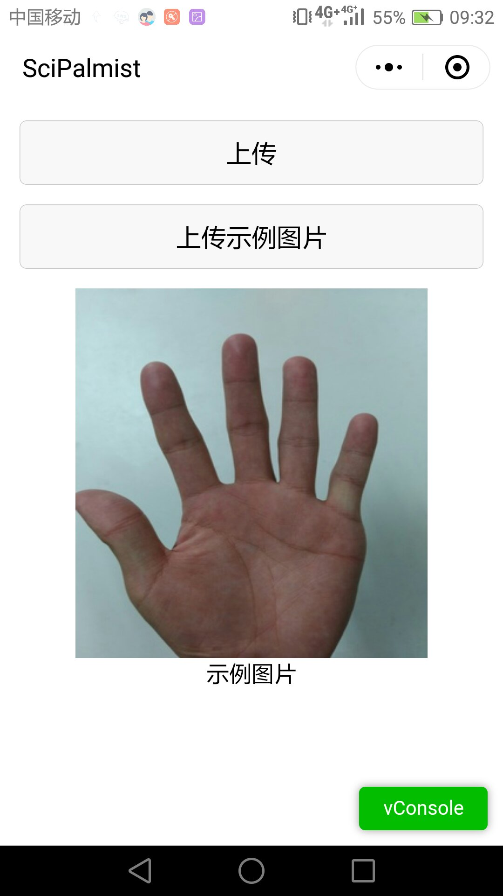
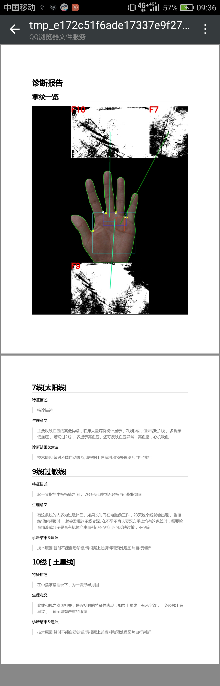

Scipalmist的作品简介
===================
#### 点击[这里](http://www.lihao7086.com:8001)查看我们的`官方主页`,里面有最详细的说明  
#### 点击[这里](https://github.com/KiyomiHan/palm_dealing)查看我们的`github`,里面有我们的所有代码 
#### 点击[这里](https://github.com/KiyomiHan/palm_dealing/blob/master/tech_frame.md)查看我们的`技术架构`

## 我们的目的 ##
慢性病不可怕，可怕的是防治不及。  
根据手诊理论，我们身体某些特征会在手掌上有所体现，譬如色泽，纹路等。  
对于慢性病来说，在患者感觉不适之前，手掌上就已经有所体现。  
如果能够了解我们手掌所暗示的信息，我们就能够提前去医院诊断，避免小病拖成大病。  
中医手诊体系在这方面成果颇丰，我们希望能够将手诊理论借助现代工具进入寻常百姓家。  
虽然手诊预测不能完全准确，但是能够提供一种低沉本的概率预测慢性病的方法也是极有价值的。  

## 我们做了什么 ##
基于Azure云平台，我们做了一套自动诊断系统，能够根据一张手的图片给出预测结果。  
本着方便大众的目的，我们的客户端采用微信的小程序，尽可能少占用用户资源且跨平台。  
我们有两种模式：
* 大众模式。用户上传自己的数据得到诊断结果。面向的是普通群众。
* 专家模式。用户可以上传带有标签的数据，比如已经确诊冠心病患者的手掌。这将完善我们的神经网络。面向的是研究相关方面的学者及医护人员。

我们的项目是完全[开源](https://github.com/KiyomiHan/palm_dealing)的，任何人可以将我们的代码进行改进用作别的用处，也欢迎任何有价值的反馈，更期望得到相关部门所提供的数据。  

## 如何使用我们的作品 ##

搜索小程序“scipalmist”  

 

您可以点击`上传` 然后选择您要上传的照片，目前算法的鲁棒性并不好，请尽可能按照示例图片的手势来拍照.  
如果超过１分钟没有反馈则说明识别失败．这是一为肤色检测的方法对环境的适应性不高，我们正在尝试用深度学习来解决这一问题.   
您也可以点击`上传示例图片`来上传我们预置好的图片，查看返回结果  

点击完成后就会上传，由于上传原图，所以需要一些上传时间.  
上传完毕后，服务器会将处理后的图片和诊断报告整合为一个pdf，返回给客户端

