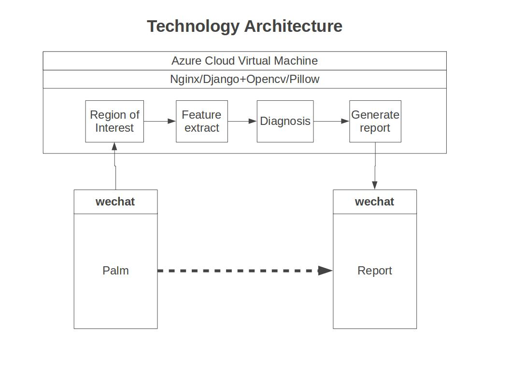
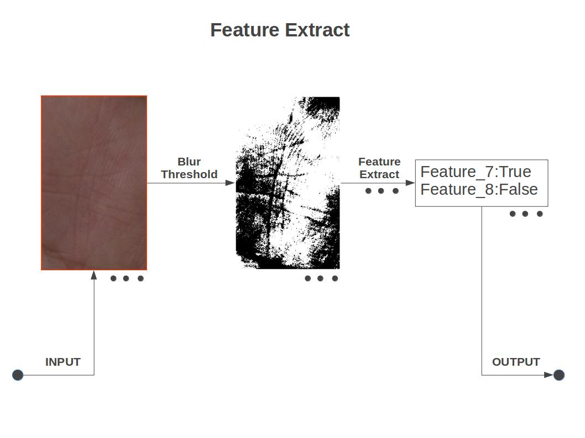
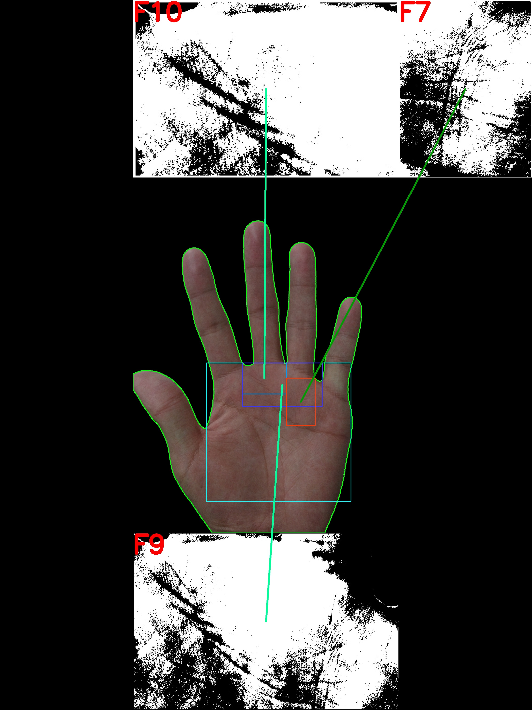

## 技术架构 ##   

   

 

### Wechat ###   
我们在客户端上选择微信平台的小程序，因为它兼容性好且占用户资源少。   
小程序的实现上传图片给服务器，接受并显示服务器回传的诊断报告。   
   
### 云端 ###   
我们采用Azure提供的CVM(Cloud Virtual Machine)．系统版本是centos7.2。   
我们的网络服务采用的nginx+django．django完成所有的网络功能架构部署．由于wechat的安全需要，我们需要nginx开启https协议。   
我们的所有图片处理以python opencv为主，其提供了大量的操作工具。同时我们用pillow来生成报告   
   
#### Region Of Interest ####   
这一环节接受wechat端发送的手掌图片，将感兴趣的图片区域进行处理送到下一环节。流程图如下：  

具体操作步骤包括： 

> **FindContour--手掌轮廓检测。**  手掌能够和背景分离的依据是他们在YCrCb空间中差距比较大，所以将图片转为YCrCb后设置阈值既可分离。将其二值化后我们用opencv提供的`cv2.findcontour`函数来寻找轮廓， 最大的轮廓就应该是手掌的轮廓。
>
>**FindAnchor--定锚。**  为了下一步的区域划分，必须要给出几个参考点。我们参考点选择的是4个指沟的位置。先用`cv2.convexHull`函数求得手掌的凸包, 再用`cv2.convexityDefects`函数去寻找轮廓中和凸包距离的所有极大值点。而我们观察到人手掌的4个指沟恰好是距离凸包最远的4个极值点，所以经过排序后就得到了4个指沟。为了更加精确的划分区域，我们通过寻找突变斜率来寻找指沟的左下角和有下角，这样一共就有8个参考点。
>
> ** DivideRegion--区域划分。**  根据参考点的位置就可以划分区域。目的是一个区域尽可能只包含一条特征掌纹。   
   

#### Feature Extract ####   
这一环节接收多个区域图片，对每一个区域进行特征提取，判断特征是否存在，返回一个{特征名：True/False}的字典, 为下环节的生成报告做准备。下面流程图以7线为例：   

  
具体操作步骤包括：   

> **Blur&Threshold--通过模糊和二值化来预处理。**  经过多次实验，我们最终是通过`cv2.blur`函数进行`kernel=1`的模糊， 通过`cv2.threshold`函数进行`threshold=88`的二值化
> **FeatureExtract特征检测。**  对于不同的线有不同的特征提取方法，这也是我们要做开源的原因。对于7线来说，我们先通过`cv2.canny(10,100)`函数来进行边缘检测，然后通过`cv2.HoughLines`函数通过统计投票的方式来检测直线。由于我们想要的是只是判断纵向线是否存在，所以在排名靠前的若干直线中，要筛选角度满足一定条件的。如果筛选出则认为7线存在。然后以python字典的方式输出结果给下一环节。
   
#### Generate Report ####   
这一环节汇总上一环节给出的字典，基于已有的数据库和神经网络，将已存在的特征匹配的数据内容打印成报告。同时将原图像与处理后的roi部分拼接起来供用户查阅。   

效果图如下所示   

   

   
#### Database&Neural Network ####   
数据库中存放的数据来自于根据手诊书籍。神经网络中的数据来自于用户提供的数据与标签。   
数据库选用轻量级的sqlite   
我们提供两种模式，大众模式和专家模式。大众模式下人们只能够查看诊断结果不能够对神经网络做出修改，专家模式下用户可以提供数据与标签用于数据训练。   
   
